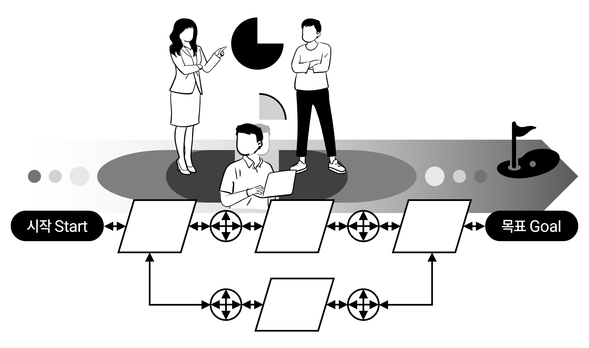
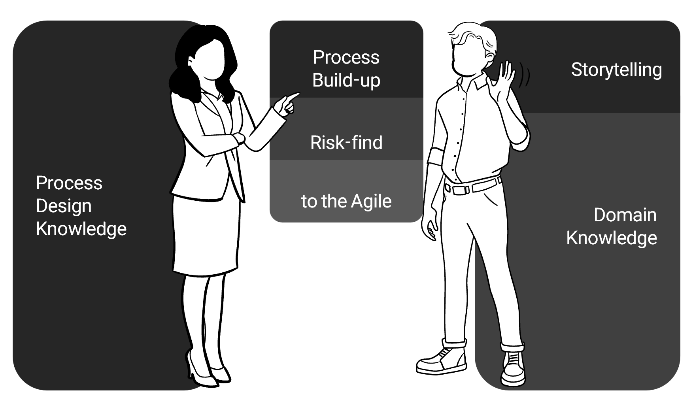

<!-- 1. 교육 비전 & 철학 -->
<section class="section" id="vision">
  
Vision & Brand

  <h2 class="section-title">AI 시대 필요한 사고(Thinking) 교육</h2>
  
  

    
Notice

    

      <strong>edu.contextonai.com</strong> 
      이하 내용은 개요이며 상세한 내용은 현재 준비 중입니다.
    

  

  

    <strong>컨텍스톤(Contexton = Context + On)</strong>은 주식회사 워플로지의 교육용 콘텐츠 및 솔루션 브랜드입니다.
  

  

    

      
🧠

      
지식 기반 사고 분석

      
워플로지의 지식 기반 창의·사고 분석 및 교육 프로그램을 제공합니다.

    

    

      
🔄

      
체계역학적 사고 교육

      
시스템 다이내믹스(System Dynamics) 이론에 입각한 입체적 사고 교육을 수행합니다.

    

    

      
💬

      
문해력과 토론·논술

      
글을 깊이 읽고, 논리 구조를 파악하며, 설득력 있는 글쓰기와 토론으로 연결하는 역량을 기릅니다.

    

  

</section>

<!-- 2. 철학적 질문 (생각의 논리 구조) -->
<section class="section">
  
Philosophy

  <h2 class="section-title">왜 '그 왜'라는 질문이 중요할까요?</h2>
  
  

    

      
The Paradox of Information

      

        두 명에게 A에 대해 설명해 달라고 요청했습니다. 
        • 한 명은 <strong>D</strong>라고 설명했고, 
        • 나머지 한 명은 <strong>C</strong>라고 설명했습니다. 
        대부분의 사람들은 익숙하고 노출 빈도가 높은 <strong>D</strong>라는 정보를 수용합니다.
      

    

    

      
The Core of Thinking

      

        우리는 <strong>A를 C라고 설명한 '그 왜'</strong>에 집중합니다. 
        질문을 통해 생각의 논리 구조(온톨로지)를 직접 그려보고, 가려진 새로운 가능성(Weak Signal)을 발견하여 더 설득력 있는 의사결정을 내릴 수 있는 사고 체계를 기릅니다.
      

    

  

  

    인공지능(AI) 시대에 가장 필요한 역량은 단순히 지식을 아는 것이 아니라, AI의 답변을 <strong>"어떻게 수용하고 검증할 것인가"</strong>에 대한 생각의 힘이기 때문입니다.
  

</section>

<!-- 3. 교육 솔루션 -->
<section class="section" id="solutions">
  
Solutions

  <h2 class="section-title">AI 시대 맞춤형 사고 교육 솔루션</h2>
  
  

    

      
🎮

      
컨텍스톤 게임

      
체계역학적 사고를 게임 환경 속에서 자연스럽고 즐겁게 훈련할 수 있는 게이미피케이션 콘텐츠입니다.

    

    

      
💻

      
컨텍스톤 플랫폼

      
생각의 도식을 온톨로지 맵으로 정밀하게 시각화하고 상호 피드백을 주고받는 협업 교육 도구입니다.

    

    

      
⚙️

      
워플로지 AI·온톨로지 엔진

      
작성된 생각의 논리적 모순과 연결성을 지능형으로 분석하고 강화 포인트를 제안해주는 독자적인 기술 엔진입니다.

    

  

</section>

<!-- 4. 교육 프로세스 및 스킬 -->
<section class="section" id="process">
  
Process & Skill

  <h2 class="section-title">교육 프로세스 및 기법</h2>
  

    과학적인 분석 절차와 정교하게 다듬어진 사고 스킬셋을 통해 생각을 맥락화합니다.
  

  

    

      
      Thinking 프로세스
    

    

      
      사고 기법 및 툴
    

  

</section>

<!-- 5. 교육 문의 -->
<section class="section" id="contact">
  
Contact

  <h2 class="section-title">교육 문의</h2>
  
컨텍스톤 프로그램의 학원·학교 도입, 협업 등 궁금하신 사항이 있다면 언제든 문의해 주세요.

  
  

    

      
이메일 문의

      
<a href="mailto:worflogy@worflogy.com">worflogy@worflogy.com</a>

    

    

      
카카오 상담

      
<a href="https://open.kakao.com/o/sDuIFoNh" target="_blank" rel="noopener noreferrer">카카오 오픈톡</a>

    

  

  

    <a href="mailto:worflogy@worflogy.com" class="btn btn-primary">이메일 보내기</a>
    <a href="https://open.kakao.com/o/sDuIFoNh" target="_blank" rel="noopener noreferrer" class="btn btn-outline">실시간 카카오톡 상담</a>
  

</section>
