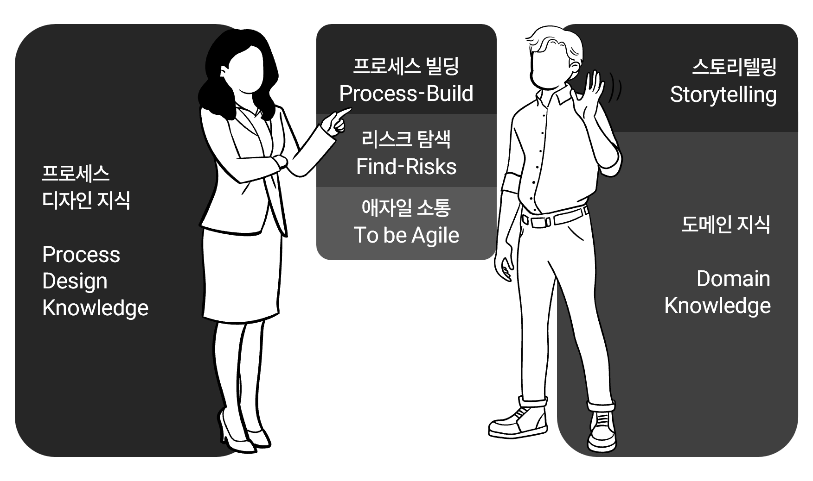

# AI 시대 필요한 사고(Thinking) 교육

> edu.contextonai.com
> 이하 내용은 개요이며 상세한 내용은 현재 준비 중입니다. 

**컨텍스톤(Contexton = Context + On)** 
**주식회사 워플로지**의 교육용 콘텐츠 및 솔루션 브랜드입니다.

- 워플로지의 지식 기반 창의·사고 분석 및 교육 프로그램
- 체계역학적(System Dynimics) 사고(Thinking) 교육
- 문해력과 논술, 토론

---

> AI 시대 맞춤형 사고(Thinking) 교육 솔루션

| 컨텍스톤 게임 |
|---|
| 컨텍스톤 플랫폼 |
| 워플로지 AI·온톨로지 엔진 |

---

> **두 명에게 A에 대해 설명해 달라고 요청했습니다.**
> - 한 명은 D라고 설명했고, 나머지 한 명은 C라고 설명했습니다.
> - 대부분 A에 대한 설명은 D라는 정보에 우리는 노출되어 왔고 그래서 익숙합니다.
> - 그래서 나머지 한 명이 A를 C라고 설명한 '그 왜'가 궁금합니다.
> - **워플로지의 Thinking 교육**은 '그 왜'라는 질문을 통해 **생각의 논리 구조(온톨로지)를 직접 그려보고**, 주류 의견에 가려진 **새로운 가능성(Weak Signal)을 발견**하여, **더 설득력 있는 의사결정을 내릴 수 있는 사고 체계**를 제공합니다. AI 시대에 가장 필요한 것은 사용자의 "어떻게 수용하고 검증할 것인가"의 역량이기 때문입니다.

---

